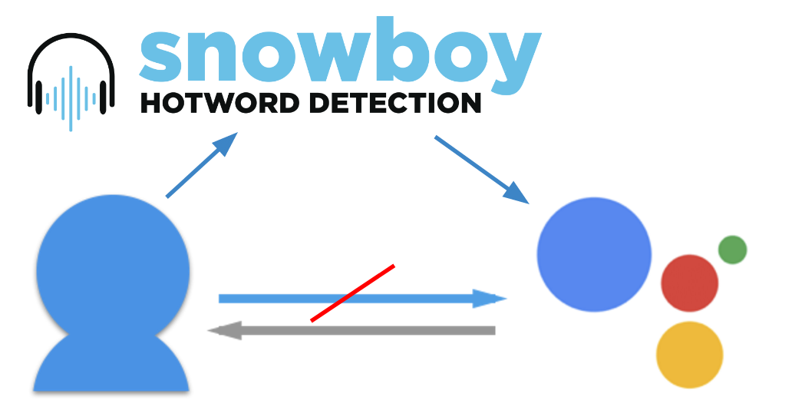

# Setup your own Google Home and custom Hotwords

In this article I will show you how to setup your own Goolge Home on your Raspberry Pi or any other Linux computer. 
Further I will teach you how can create own triggers and hotwords for you assistant. 

## Hardware

Before we start, make sure you have connected a microphone and speakers to your device. A regular usb webcame will also to the trick. 

To check if the devices are actual connected we use the command:

```bash
arecord -l
``` 
to check the microphone and 
```bash
aplay -l
``` 
for the speakers.

At this point it is importend that you remember the card number and device number of the microphone and speaker you have chosen to use.

This gained numbers we now have to write in our configuartion file under *~/.asoundrc*:
```bash
pcm.!default {
    type asym
    playback.pcm {
        type plug
        slave.pcm "hw:1,0"
    }
    capture.pcm {
        type plug
        slave.pcm "hw:0,0"
    }
}
``` 
*Where the two numbers after **hw:** are the card number follwed by the device number and should be replaced by your own values*

More information about the ALSA sound configuration can be found [here](https://wiki.ubuntuusers.de/.asoundrc/)

Now you should be able to record sound with:
```bash
rec test.wav
``` 
and hear you own voice with:
```bash
play test.wav
``` 

## Google Assistant 

### Google API Registeration
First if you don't have an google account already, create one. After you are logged in to the google devloper console, create a new project. Now we have to enable the [Assistant API](https://console.developers.google.com/apis/api/embeddedassistant.googleapis.com/overview). Next, to create our OAuth ClientID we have to go [here](https://console.developers.google.com/apis/credentials/oauthclient). Select **"Other"** and when you finshed download the json file,you can transfer it to your Raspberry Pi with:
```bash
scp ~/Downloads/client_secret_client-id.json pi@raspberry-pi-ip-address:/home/pi/
```

### Install Google Assistant Library
To download and install the libarary in a python3 enviroment we use the folling script:
```bash
sudo apt-get update
sudo apt-get install python3-dev python3-venv 
python3 -m venv env
env/bin/python -m pip install --upgrade pip setuptools
source env/bin/activate
python -m pip install --upgrade google-assistant-library
python -m pip install --upgrade google-auth-oauthlib[tool]
python -m pip install --upgrade google-assistant-sdk[samples]
```


### Authentification with google cloud
Before we can use the assistant we first have to authorize our application. To do this we call:
```bash
google-oauthlib-tool --client-secrets /path/to/client_secret_client-id.json --scope https://www.googleapis.com/auth/assistant-sdk-prototype --save --headless
```
We will recive a code on a website that we have to enter in the terminal.

### Run the sample
Once you authorized your application, you can now run the sample from google.
```bash
google-assistant-demo
```
You now have built a regular google home and can trigger your running assistant with *"OK, Google"* or *"Hey, Google"*.

## Custom Trigger
Since we are building our Google Home on our own, we are open to customization. So we will create our own Trigger. While others use a button to trigger there Assistant, I still want to use voice. I just wasn't so happy with the hotword, so I replaced it with something more sympathetic to me: *"Samantha"*, but you can choose anything you like. 

### Snowboy

To create our own personal trained model for hotword detection we use the [Snowboy Engine](https://snowboy.kitt.ai/)

### Create Hotword
Once you are logged in you have the option to choose a existing hotword or create your own. 
In any case you will receive the model as file to download. After downloading you also need to transfer this file to your Raspberry Pi.

### Python3 Support
Unfortunately [Snowboy](https://snowboy.kitt.ai/) just delivers exceutable binarys for Python 2. To work with our Python 3 Google Assistant Library we need to build the binary on our own. To do this we first clone the Snowboy github reporsitory:
```bash
git clone https://github.com/Kitt-AI/snowboy.git
```
First we have make the snowboydetect.py file with swig in the directroy */swig/python3/*
```bash
make
```
*You need to have swig v3.0.10 or higher - if you are stuck read the comments of the Makefile*

 After successful build you shound be able to run the Snowboy sample under *examples/Python3/* with:
 ```bash
python demo.py your-trained-model.pmdl
 ```    

### Trigger Google Assistant with Snowboy
The Last step is to connect Snowboy with the Google Assistant. That means when Snowboy detects your hotword, it will activate the Google Assistant, so he starts listening immediately. You dont need to say *"OK, Google"* anymore. 



First we change the snowboy demo.py file to call the google library:
```python
import snowboydecoder
import sys
import signal
from googlesamples.assistant.grpc.pushtotalk import main
interrupted = False


def signal_handler(signal, frame):
    global interrupted
    interrupted = True


def interrupt_callback():
    global interrupted
    return interrupted


model = "your-trained-model.pmdl" 

# capture SIGINT signal, e.g., Ctrl+C
signal.signal(signal.SIGINT, signal_handler)

detector = snowboydecoder.HotwordDetector(model, sensitivity=0.5)
print('Listening... Press Ctrl+C to exit')

detector.start(detected_callback=main,
               interrupt_check=interrupt_callback,
               sleep_time=0.03)

detector.terminate()
```

After that we modify the google library file at the end in you python enviroment under */env/lib/python3.5/site-packages/googlesamples/assistant/grpc/pushtotalk.py* and replace following code at the end of the file
```python
wait_for_user_trigger = not once
while True:
    if wait_for_user_trigger:
        click.pause(info='Press Enter to send a new request...')
    continue_conversation = assistant.converse()
```
with 
```python 
wait_for_user_trigger = once
while True:
    if wait_for_user_trigger:
        return
    continue_conversation = assistant.converse()
```
Now you should be able to trigger you assistant with your own hotword by running the snowboy *demo.py*.

### Conclusion
I hope you got some inspiration for further expirements with the Google Assistant. Another intresting point is for exaple to jump strait in your own google voice app.
If you want to know how to build a google voice application, check out my other post [here](TODO)

Thanks for reading through my post. For feedback or questions feel free to contact me. 


#### Cheers!

#### Moritz Gruber, mg166
[Website](http://moritzgruber.me)

[Github](https://github.com/MoritzGruber)

[Twitter](https://twitter.com/movCode)


